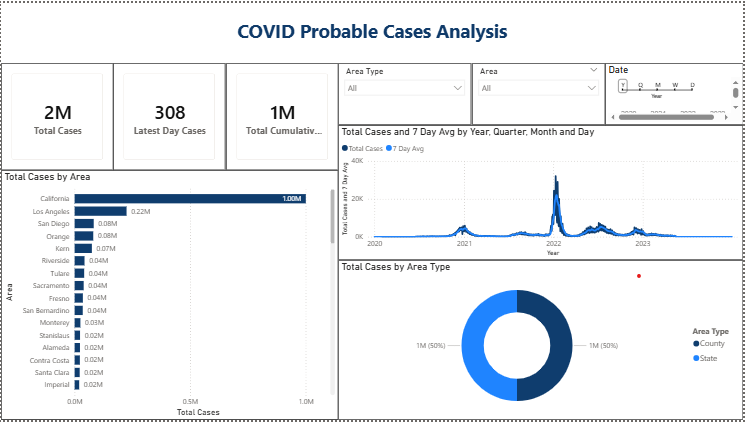

# COVID-19 Cases Analysis Dashboard (Power BI) 📊

## 📌 Project Overview
This project presents an interactive **Power BI dashboard** to analyze COVID-19 case data.  
It provides insights into total cases, latest daily cases, and overall trends using visual analytics.

---

## 🎯 Objectives
- Track total and daily COVID-19 cases  
- Analyze trends over time  
- Compare cases across different areas and area types  
- Enable interactive filtering for better insights  

---

## 📊 Dashboard Components

### 🔢 KPI Cards
- **Total Cases** – Displays total confirmed cases  
- **Latest Day Cases** – Shows cases for the most recent date  
- **Total Cumulative Cases** – Represents overall aggregated cases  

---

### 🎛️ Filters / Slicers
- **Area** – Filter data by region  
- **Area Type** – Categorization (e.g., Urban / Rural)  
- **Date** – Select specific time periods  

---

### 📈 Visualizations

#### 1️⃣ Bar Chart – Total Cases by Area
- Displays total cases across different areas  
- Helps identify high-case regions  

#### 2️⃣ Donut Chart – Total Cases by Area Type
- Shows proportional distribution of cases  
- Useful for category comparison  

#### 3️⃣ Line Chart – Trend Analysis
- X-axis: Date  
- Y-axis: Total Cases  
- Includes **7-Day Moving Average**  
- Helps visualize trends and smooth fluctuations  

---

## 🖼️ Dashboard Preview



---

## 🧠 DAX Measures

```DAX
Total Cases = SUM('Data'[Confirmed Cases])

Latest Day Cases = 
CALCULATE(
    SUM('Data'[Confirmed Cases]),
    LASTDATE('Data'[Date])
)

Total Cumulative Cases = 
CALCULATE(
    SUM('Data'[Confirmed Cases]),
    ALL('Data'[Date])
)

7 Day Avg = 
AVERAGEX(
    DATESINPERIOD(
        'Data'[Date],
        MAX('Data'[Date]),
        -7,
        DAY
    ),
    [Total Cases]
)
